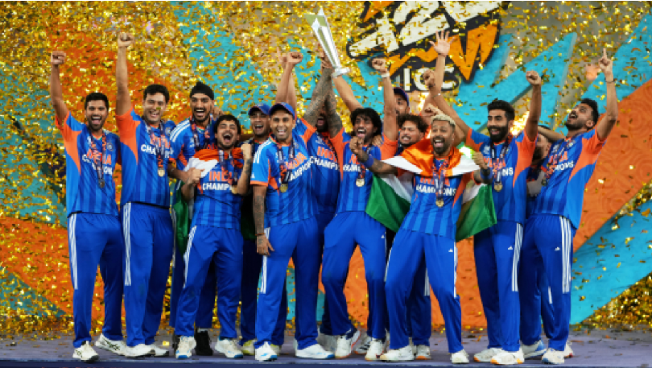
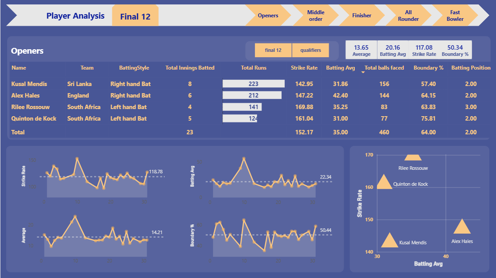
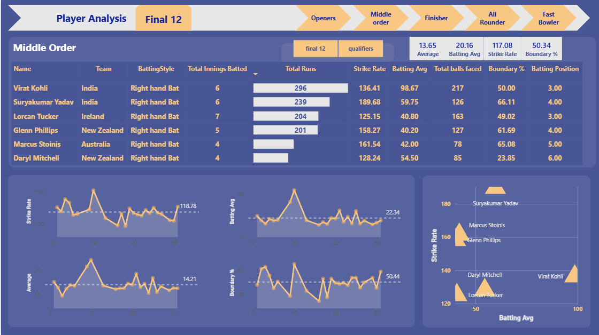
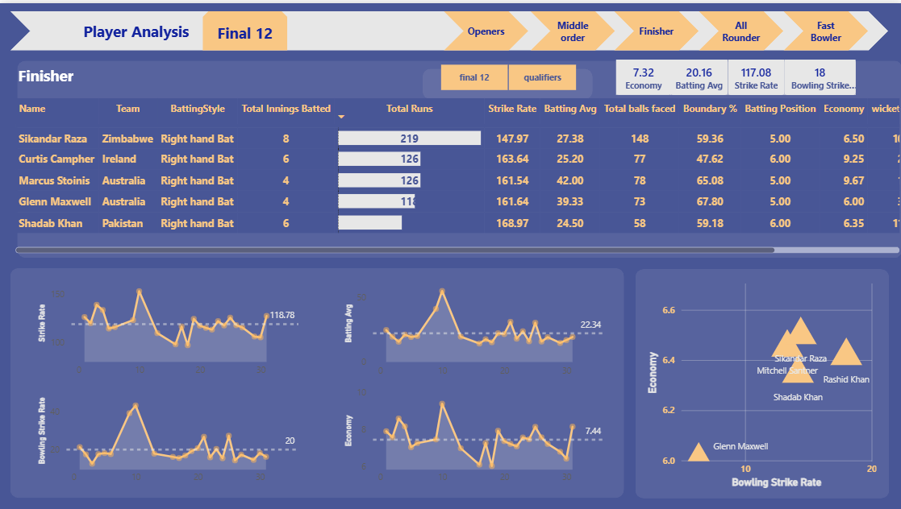
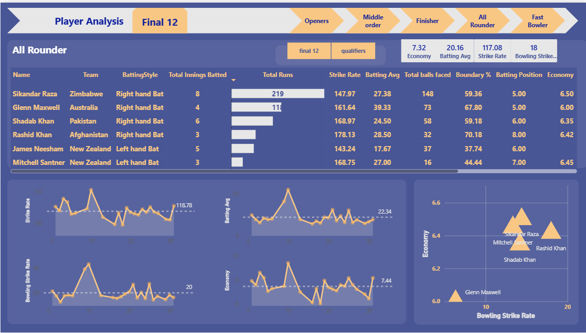
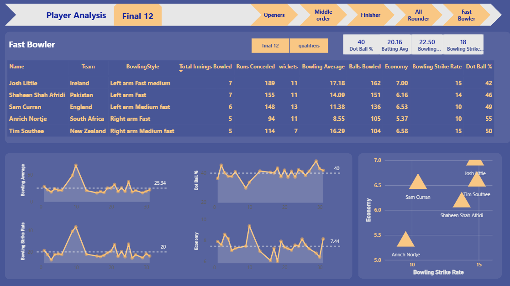
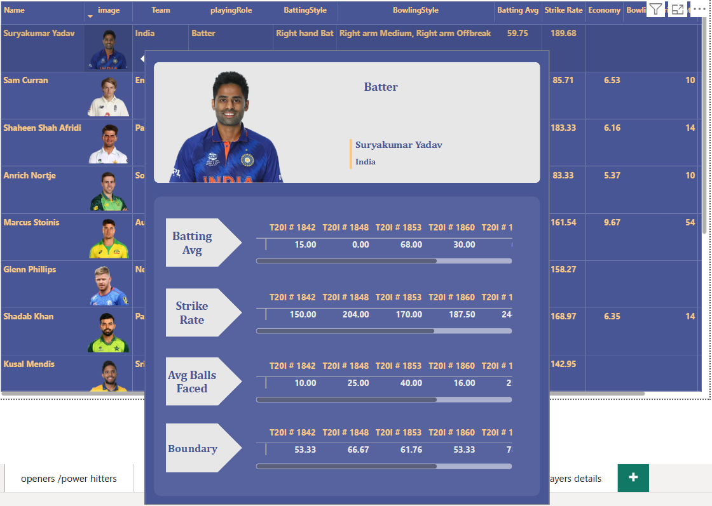

# T20 World Cup 2022 — Cricket Performance Analyser




An end-to-end cricket analytics pipeline — from raw ESPN Cricinfo data to a role-based interactive Power BI dashboard for selecting the optimal Final 12 from the T20 World Cup 2022.

[View Live Dashboard](https://app.powerbi.com/links/701SuKGn2S?ctid=3945f3d2-19fb-477d-a4e9-31e599a1676e&pbi_source=linkShare) &nbsp;·&nbsp; [Download Report (.pbix)](https://github.com/Vandangj/cricket-performance-analyser/blob/main/dashboard/crick.pbix)

---

## 📸 Dashboard Preview

> Navigate between pages using the role tabs at the top of the live dashboard.

**Openers**


**Middle Order**


**Finisher**


**All Rounder**


**Fast Bowler**


**Player Card — Interactive**


---

## 📌 Overview

This project evaluates 5,000+ historical player records across batting, bowling, and all-round roles from the T20 World Cup 2022. The analysis is structured by playing role — Openers, Middle Order, Finishers, All Rounders, and Fast Bowlers — with each dashboard page providing dedicated metrics, trend analysis, and scatter-plot comparisons for that role.

The output is a data-driven Final 12 selection supported by custom-engineered performance metrics, DAX-powered KPIs, and an interactive player card system with match-by-match breakdowns.

---

## 📊 Dashboard Pages

### Openers
Ranks opening batters by total runs, strike rate, batting average, and boundary percentage. A scatter plot of Strike Rate vs Batting Average identifies players who are both aggressive and consistent. Trend lines track form progression across the tournament.

**Notable:** Kusal Mendis (Sri Lanka) — 223 runs, 142.95 SR across 8 innings.

---

### Middle Order
Evaluates batters at positions 3–5 on consistency and match-impact metrics. Dynamic KPI cards benchmark each player against tournament-wide averages.

**Notable:** Virat Kohli (India) — 296 runs, 98.67 average, 136.41 SR.

---

### Finisher
Focuses on players batting at positions 5–7 under pressure. Incorporates bowling economy and strike rate for players contributing in both departments.

**Notable:** Sikandar Raza (Zimbabwe) — 219 runs, 147.97 SR, 6.50 economy.

---

### All Rounder
Dual-axis analysis covering batting output and bowling contribution simultaneously. Scatter plot of Economy vs Bowling Strike Rate identifies the most impactful all-rounders.

**Notable:** Glenn Maxwell, Shadab Khan, Rashid Khan.

---

### Fast Bowler
Ranks pace bowlers across wickets, economy, bowling average, bowling strike rate, and dot ball percentage. Dot ball % is weighted as a key pressure metric.

**Notable:** Anrich Nortje (South Africa) — 11 wickets, 5.37 economy, 55% dot ball rate.

---

### Player Card
Clicking any player in the data table expands an individual performance card showing match-by-match breakdowns — batting average, strike rate, average balls faced, and boundary % per T20I — with progress bars for visual comparison. Each card includes the player's photo, team, and playing role.

---

### Final 12
Aggregates top performers from each role into a single selection view. Supports toggling between Qualifier-stage and Finals-stage data with all metrics visible side by side.

---

## 🗄️ Dataset

| File | Description |
|------|-------------|
| `dim_match_summary.csv` | Match-level results across all T20 WC 2022 fixtures |
| `dim_players.csv` | Player metadata with images — team, role, batting/bowling style |
| `dim_players_no_images.csv` | Player metadata without images — used for lightweight processing |
| `fact_bating_summary.csv` | Innings-level batting records per player per match |
| `fact_bowling_summary.csv` | Innings-level bowling records per bowler per match |

**Source:** ESPN Cricinfo

---

## 🔧 Tech Stack

| Technology | Purpose |
|-----------|---------|
| Power BI Desktop | Dashboard design, multi-page navigation, report publishing |
| DAX | Custom KPIs, dynamic measures, calculated columns |
| Python — Pandas, NumPy | Data wrangling, metric engineering, ETL pipeline |
| Power Query (M) | Final transformation and data loading into Power BI |

---

## 📐 Custom Metrics

Standard cricket statistics (average, strike rate, economy) were supplemented with engineered metrics to better capture player value:

| Metric | Definition | Purpose |
|--------|-----------|---------|
| Consistency Score | `mean(runs) / (std(runs) + 1)` | Penalizes erratic performers; rewards stable output |
| Boundary % | `(4s×4 + 6s×6) / total_runs × 100` | Quantifies scoring aggression via boundary contribution |
| Bowling Strike Rate | `balls_bowled / wickets` | Measures how quickly a bowler takes wickets |
| Dot Ball % | `dot_balls / balls_bowled × 100` | Captures a bowler's ability to apply pressure |

Full definitions and all DAX measures in [`docs/DAX-Measures-and-Calculated-Columns.xlsx`](docs/DAX-Measures-and-Calculated-Columns.xlsx)

---

## 🧮 DAX Measures

```dax
-- Batting Average
Batting Avg =
DIVIDE(SUM(fact_bating_summary[runs]), SUM(fact_bating_summary[innings_dismissed]))

-- Boundary Percentage
Boundary % =
DIVIDE(SUM(fact_bating_summary[boundary_runs]), SUM(fact_bating_summary[runs])) * 100

-- Bowling Strike Rate
Bowling SR =
DIVIDE(SUM(fact_bowling_summary[balls_bowled]), SUM(fact_bowling_summary[wickets]))

-- Dot Ball Percentage
Dot Ball % =
DIVIDE(SUM(fact_bowling_summary[dot_balls]), SUM(fact_bowling_summary[balls_bowled])) * 100

-- Consistency Score
Consistency Score =
AVERAGEX(fact_bating_summary, DIVIDE(fact_bating_summary[runs], fact_bating_summary[balls]) * 100)
```

---

## 🐍 Python Pipeline

```python
import pandas as pd
import numpy as np

# Load raw data
batting = pd.read_csv('data/raw/fact_bating_summary.csv')
bowling = pd.read_csv('data/raw/fact_bowling_summary.csv')
players = pd.read_csv('data/raw/dim_players_no_images.csv')
matches = pd.read_csv('data/raw/dim_match_summary.csv')

# Handle missing values
batting['runs'].fillna(0, inplace=True)
batting['balls'].fillna(batting['balls'].median(), inplace=True)

# Engineer core metrics
batting['strike_rate'] = (batting['runs'] / batting['balls']) * 100
batting['boundary_runs'] = (batting['fours'] * 4) + (batting['sixes'] * 6)
batting['boundary_pct'] = (batting['boundary_runs'] / batting['runs'].replace(0, np.nan)) * 100

# Consistency score — rewards stable performers over one-match wonders
batting['consistency_score'] = batting.groupby('batsmanName')['runs'].transform(
    lambda x: round(x.mean() / (x.std() + 1), 2)
)

batting.to_csv('data/processed/batting_cleaned.csv', index=False)
bowling.to_csv('data/processed/bowling_cleaned.csv', index=False)
```

---

## 📁 Repository Structure

```
📦 cricket-performance-analyser
 ┣ 📂 dashboard
 ┃ ┗ 📄 crick.pbix
 ┣ 📂 data
 ┃ ┗ 📂 raw
 ┃ ┃ ┣ 📄 dim_match_summary.csv
 ┃ ┃ ┣ 📄 dim_players.csv
 ┃ ┃ ┣ 📄 dim_players_no_images.csv
 ┃ ┃ ┣ 📄 fact_bating_summary.csv
 ┃ ┃ ┗ 📄 fact_bowling_summary.csv
 ┣ 📂 screenshots
 ┃ ┣ 🖼️ openers.png
 ┃ ┣ 🖼️ middle_order.png
 ┃ ┣ 🖼️ finisher.png
 ┃ ┣ 🖼️ all_rounder.png
 ┃ ┣ 🖼️ fast_bowler.png
 ┃ ┗ 🖼️ player_card.png
 ┣ 📂 docs
 ┃ ┗ 📄 DAX-Measures-and-Calculated-Columns.xlsx
 ┗ 📄 README.md
```

---

## ▶️ Running Locally

1. Install [Power BI Desktop](https://powerbi.microsoft.com/desktop/)
2. Clone the repository:
   ```bash
   git clone https://github.com/Vandangj/cricket-performance-analyser.git
   ```
3. Open `dashboard/crick.pbix` in Power BI Desktop
4. Re-link data sources to `/data/raw/` if prompted

---

## 💡 Key Findings

- Virat Kohli led the middle order with 296 runs at a 98.67 average and 50% boundary rate across 6 innings
- Suryakumar Yadav posted the highest strike rate among middle-order batters at 189.68
- Anrich Nortje was the most economical fast bowler — 5.37 economy with a 55% dot ball rate across 5 innings
- Sikandar Raza was the tournament's standout all-rounder, contributing 219 runs with the bat and a 6.50 economy with the ball
- Sam Curran led fast bowlers in wickets (13) at an 11.38 average, making him the most impactful pace option

---

## 👤 Author

**Vandan Jethwa**  
Data Analyst · Power BI · Python · SQL

[LinkedIn](https://www.linkedin.com/in/vandan-jethwa-74489a241) &nbsp;·&nbsp; [GitHub](https://github.com/Vandangj)

---

*MIT License*
